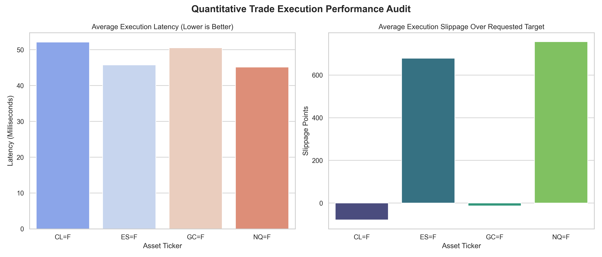

# Quantitative Trade Performance Auditor & Analytics Pipeline

An automated, self-service end-to-end data processing framework engineered to ingest, clean, and analyze high-frequency multi-source algorithmic execution files. This system isolates transactional execution anomalies (slippage metrics and latency deviations), translates them into an optimized database environment for cross-functional business stakeholders, and provides automated reporting visualizations.



## Technical Architecture & Core Capabilities

* **Exploratory Data Analysis & Transformation:** Parses variable transaction streams, handles missing metadata constraints, flags mathematical data errors, and engineers customized performance fields (slippage_points).
* **SQL & Python Execution Pipeline:** Features an automated extraction layer loading unstructured logs directly into an indexed SQLite storage structure optimizing retrieval paths.
* **Automated Data Visualization Engine:** Programmatically extracts database metrics via localized SQL aggregations to generate high-resolution distribution plots tracking performance bottlenecks.
* **Enterprise Stability Testing:** Implements automated, isolated unit tests checking processing pipeline edge-cases, validation limits, and data sanitization routines.
* **Robust Logging Architecture:** Integrates Python's native `logging` module to concurrently emit timestamped execution tracking telemetry ([INFO], [ERROR]) to both terminal streams and persistent file logs.
* **Self-Service Business Interface:** Implements an intuitive parameterized CLI query framework, shielding business operators from manual database querying while delivering split-second metric extraction.

---

## Data Architecture & Storage Design

### Architectural Decisions

* **Storage Engine Selection (SQLite):** Selected a localized, serverless relational layout file structure to eliminate unnecessary network communication overhead during processing, achieving rapid local write performance. This approach ensures an independent file structure that requires zero infrastructure provisioning for business end-users.
* **Performance Tuning & Query Optimization:** High-frequency transaction logs inherently scale linearly. To prevent sequential table scans as records expand, a custom database index (idx_ticker) was engineered directly onto the asset_ticker column. This forces the relational execution engine to perform localized B-Tree index lookups instead of full table scans, reducing lookup runtimes to O(log n) efficiency.

---

## Project Structure

```text
trade-performance-auditor/
├── assets/                     # Public graphic containers for repository displays
│   └── latency_slippage_audit.png
├── data/                       # Local file arrays, logs, and storage database engine
├── src/
│   ├── pipeline.py             # Python & SQL ETL execution pipeline module
│   ├── plots.py                # Database metric visual plotting module
│   └── app.py                  # Self-service parameter configuration interface
├── tests/
│   └── test_pipeline.py        # Automated Pytest suite tracking pipeline logic
├── .gitignore                  # Tracking exclusion matrices
├── requirements.txt            # Frozen environment dependencies
└── README.md                   # Operational portfolio documentation
```
# Setup & Local Execution Guide
## 1. Environment & Dependency Installation
Isolate dependencies using a local Python environment wrapper:
```
conda activate trade_env
pip install pandas==2.2.0 numpy==1.26.0 pyarrow matplotlib seaborn pytest
```
## 2. Run the Data Pipeline & Generate Visualization
Execute the automated script sequence to ingest raw files, evaluate internal metrics, load structural database records, and export performance reports:
```
# Run data extraction and database loading
python src/pipeline.py

# Generate and save the visual distribution report
python src/plots.py
```
## 3. Running Automated Test Suites
Verify algorithmic cleaning logic and mathematical field constraints against production-simulated data arrays:
```pytest```
## 4. Querying Metrics via Self-Service Portal
Extract automated, localized metrics targeted by specific ticker keys directly through command arguments:
```
# Extract overall execution metrics across all trading lines
python src/app.py

# Extract metrics targeted directly to Nasdaq Futures profiles
python src/app.py NQ=F
```