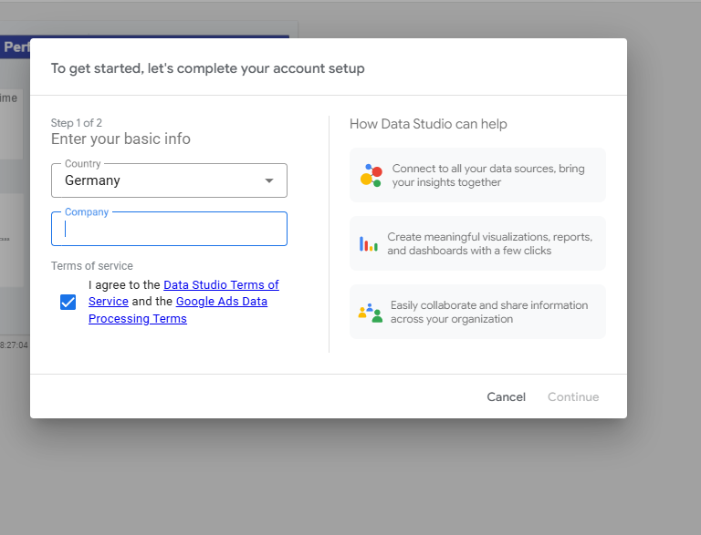

# High-Throughput Transactional Analytics & ETL Pipeline

An end-to-end data engineering and analytics pipeline designed to ingest, sanitize, and model high-frequency transactional log data into an optimized relational analytics warehouse.

## 📊 Interactive Business Intelligence Dashboard

> 🔗 **[View the Live Looker Studio Dashboard]()** > *Note: This interactive dashboard connects directly to our structured cloud warehouse layer, displaying real-time operational metrics, execution success rates, and processing latencies.*

---

## 🎯 Business Context & Core Impact

High-throughput transactional networks (such as algorithmic trading frameworks, e-commerce ad exchanges, and digital payment rails) generate massive volumes of unstructured event logs. Raw logs are natively prone to execution anomalies, network jitter, and silent failures that mask underlying system inefficiencies and cause compounding financial slippage.

* **The Problem:** Manual audit trails are unscalable, rendering it difficult to capture systemic latency, dropped events, or execution variance.
* **The Solution:** This project engineers a robust, automated ETL pipeline using Python to parse distributed transaction logs, enforce strict programmatic data validation, and model storage layouts in an optimized relational database.
* **The Business Value:** Transforms raw data noise into clear operational intelligence—reducing system auditing latency from manual hours to seconds, and exposing immediate optimization areas for engineering and business stakeholders.

---

## 🏗️ Core Architecture & Pipeline Flow

[ Raw Log Ingestion ]   --> Streamed or batched text data (.log / .csv)
          │
          ▼
[ Python ETL Engine ]   --> Pathlib handling / Pandas structural sanitization
          │
          ▼
[ Data Quality Engine ] --> Runtime type-casting, null-handling, & unit testing
          │
          ▼
[ Database Layer ]      --> Relational schema design with optimized SQL querying
          │
          ▼
[ BI Visualization ]    --> Cloud integration (BigQuery) to interactive Looker dashboards


### 1. Ingestion & Automation (`src/pipeline.py`)

* Leverages decoupled system file architectures to automatically locate, stream, and isolate unparsed execution logs.
* Processes transactional metrics including tracking timestamps, status codes, modules, and performance overhead (in milliseconds).

### 2. Data Quality Engineering & Integrity

* Programmatically isolates corrupted fields, type mismatches, and structural anomalies.
* Embeds explicit unit testing criteria to ensure that downstream metrics (such as average system latencies or failure distributions) map to pristine, accurate data points.

### 3. Database Modeling & SQL Analytics

* Structurally normalizes high-frequency transactional records into normalized relational entities.
* Optimized SQL querying schemas allow rapid multi-dimensional slicing (e.g., aggregating error distributions across specific runtime engines or analyzing time-series volume spikes).

---

## 📈 Cross-Industry Metric Mapping

The engineering architecture embedded in this pipeline applies directly to any high-volume transactional ecosystem:

| Analytical Engine Logic                      | Financial Trading Context              | Retail Media / E-Commerce Context         |
| :------------------------------------------- | :------------------------------------- | :---------------------------------------- |
| **Execution Variance / Latency**       | Network Slippage & Execution Speed     | Ad Server Placement Latency & API Lag     |
| **Performance Ingestion Success Rate** | Strategy Win Rate / Fill Ratios        | Campaign Conversion Rates & ROAS Metrics  |
| **System Attrition / Structural Risk** | Drawdown Caps & Margin Monitoring      | User Churn & Customer Retention Drop-offs |
| **Expected Value Modeling**            | Strategy Expected Performance ($EV$) | Customer Lifetime Value (CLV) Calculation |

---

## 🚀 Quickstart & Pipeline Validation

### Prerequisites

* Python 3.10+
* SQLite3 / PostgreSQL

### 1. Installation

Clone the repository and install dependencies:

```bash
git clone [https://github.com/YOUR_GITHUB_USERNAME/trade-performance-auditor.git](https://github.com/YOUR_GITHUB_USERNAME/trade-performance-auditor.git)
cd trade-performance-auditor
```

### 2. Generate Mock Dataset

Initialize the local environment with sample high-throughput logs for out-of-the-box pipeline validation:

```bash
python create_logs_file.py
```

### 3. Execute the ETL pipeline

Parse, sanitize, and load the raw mock entries into your local data warehouse layer:

```bash
python src/pipeline.py
```
